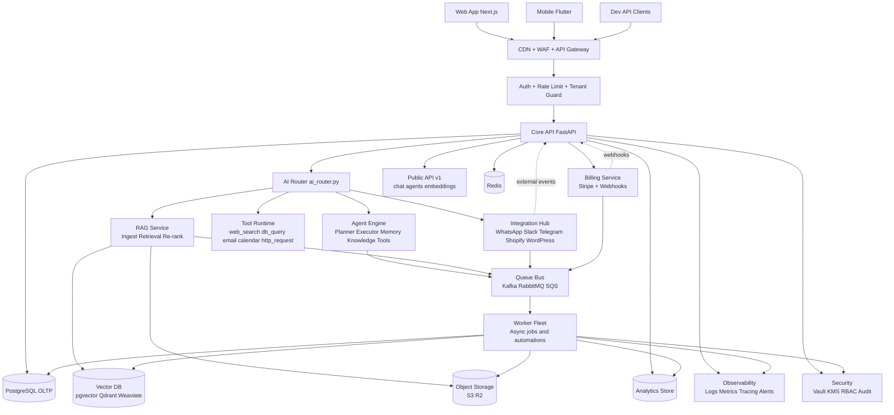

# Diagrama da Arquitetura de Escala - ALICI

## Leitura rapida
- Camada de entrada protegida por WAF + gateway.
- API stateless para scale horizontal.
- Jobs pesados e integrações rodam em workers via fila.
- Dados separados por funcao: transacional, cache, vetorial e objetos.
- Observabilidade e seguranca sao transversais a toda a plataforma.
